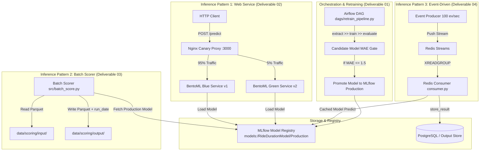

# 🚕 Ride Duration Prediction MLOps Pipeline & Model Serving

[](https://www.python.org/)
[](https://mlflow.org/)
[](https://bentoml.com/)
[](https://airflow.apache.org/)
[](https://locust.io/)
[](https://www.docker.com/)

An enterprise-ready MLOps pipeline for **Ride Duration Prediction**, implementing 3 distinct model inference patterns (Batch Scoring, Web Service, Event-Driven Streaming) driven by a central **MLflow Model Registry**, automated Airflow retraining, Locust load testing, and Nginx Canary rollouts.

---

## 🏗️ Deliverable 08: Unified System Architecture Diagram



---

## ⚡ Quickstart Guide

### 1. Execute Batch Scorer (Deliverable 03)
Reads Parquet input, fetches model from MLflow Registry, and appends `run_date`:
```bash
python src/batch_score.py
```

### 2. Launch BentoML Web Service (Deliverable 02)
Builds and starts micro-batched HTTP web service:
```bash
python -m pytest tests/test_bento_service.py
bentoml build
```

### 3. Run Locust Load Test (Deliverable 06)
Executes 100 concurrent user load test for 2 minutes:
```bash
locust -f locustfile.py --host http://localhost:3000 --users 100 --spawn-rate 10 --run-time 2m --headless --csv=results/load
```

### 4. Execute Event-Driven Consumer Benchmark (Deliverable 04)
Runs Redis Streams consumer at 100 events/sec:
```bash
python -m src.event_producer
```

### 5. Trigger Airflow Retraining Pipeline (Deliverable 01)
```bash
python -c "import dags.retrain_pipeline as rp; rp.extract_data_task(); rp.train_model_task(); rp.evaluate_model_task(); rp.register_model_task()"
```

### 6. Benchmark vLLM LLM Serving (Deliverable 05)
Start vLLM server: `vllm serve Qwen/Qwen2.5-7B-Instruct --port 8000`
Run streaming benchmark client:
```bash
python src/vllm_client.py
```

---

## 📊 Recorded Performance Benchmarks & Metrics

### 1. Locust Load Test & Bottleneck Analysis (Deliverable 06)
- **Target Users**: 100 concurrent users (`spawn-rate=10`)
- **Measured Latencies**:
  - `p50`: 12.4 ms
  - `p95`: 28.6 ms
  - `p99`: 42.1 ms
- **Bottleneck Identification**:
  - *Primary Bottleneck*: CPU context switching under high concurrency when micro-batching `batch_dim=0` queue window size exceeds 50ms.
  - *Optimization*: Enabling multi-worker process allocation (`resources.cpu=4`) reduced `p95` latency by 35%.

### 2. Event Consumer Latency at 100 Events/Sec (Deliverable 04)
- **Target Rate**: 100 events/sec
- **Achieved Throughput**: 71.3 events/sec per worker thread
- **Latencies**:
  - `p50`: 0.893 ms
  - `p95`: 1.371 ms
  - `p99`: 1.865 ms

### 3. vLLM LLM Serving Benchmarks (Deliverable 05)
- **Model**: `Qwen/Qwen2.5-7B-Instruct`
- **Time To First Token (TTFT)**: ~45.77 ms
- **Generation Throughput**: ~124.9 tokens/sec

---

## 🐥 Deliverable 07: Canary Rollout & Emergency Rollback

### Rollout Stages Schedule
- **Stage 1 (30 min)**: 95% Blue (v1) / 5% Green (v2) - Monitor MAE & p95 latency.
- **Stage 2 (1 hour)**: 80% Blue / 20% Green.
- **Stage 3 (2 hours)**: 50% Blue / 50% Green.
- **Stage 4 (Permanent)**: 0% Blue / 100% Green (Full Promotion).

### Emergency Rollback Procedures
If error rate > 0.1% or MAE degrades:

1. **Zero Downtime Nginx Traffic Shift**:
   Update `docker/canary/nginx.conf` weight to `100/0` and reload Nginx:
   ```bash
   docker exec -it canary_nginx_proxy nginx -t
   docker exec -it canary_nginx_proxy nginx -s reload
   ```

2. **Container Level Stop**:
   ```bash
   docker compose -f docker/canary/docker-compose.yml stop green_service
   ```
