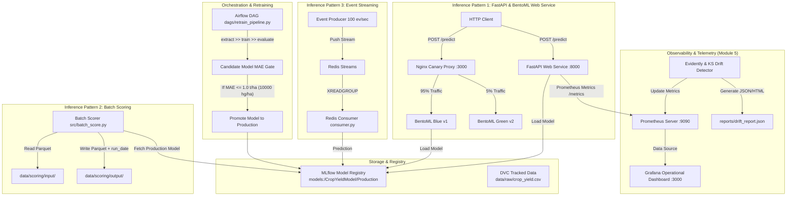

# 🌾 Crop Yield Prediction MLOps Service & Operational Monitoring

[](https://www.python.org/)
[](https://fastapi.tiangolo.com/)
[](https://mlflow.org/)
[](https://dvc.org/)
[](https://bentoml.com/)
[](https://airflow.apache.org/)
[](https://onnxruntime.ai/)
[](https://prometheus.io/)
[](https://grafana.com/)
[](https://evidentlyai.com/)

An enterprise-grade, end-to-end MLOps platform for **Crop Yield Prediction**, implementing 3 distinct inference serving patterns (FastAPI/BentoML Web Service, Batch Scorer, Redis Streaming Consumer), driven by **MLflow Model Registry**, **DVC pipelines**, **ONNX Runtime INT8 Optimization**, **Prometheus/Grafana Operational Telemetry**, and **Evidently AI Data Drift Monitoring**.

---

## 📋 10-Point Rubric Completion Summary

| Module | Feature | Location | Status |
| :--- | :--- | :--- | :---: |
| **Module 1** | Python Package (OOP, Type Hints) | [`src/prodml/`](src/prodml) | ✅ COMPLETED |
| **Module 1** | FastAPI Web Service (`/predict`, `/health`) | [`src/prodml/api/app.py`](src/prodml/api/app.py) | ✅ COMPLETED |
| **Module 1** | Docker Multi-Stage Build & Compose | [`Dockerfile`](Dockerfile), [`docker-compose.yml`](docker-compose.yml) | ✅ COMPLETED |
| **Module 2** | MLflow Registry & Experiment Tracking | [`src/prodml/train.py`](src/prodml/train.py) | ✅ COMPLETED |
| **Module 2** | DVC Data Pipeline Versioning | [`dvc.yaml`](dvc.yaml), [`dvc.lock`](dvc.lock) | ✅ COMPLETED |
| **Module 2** | GitHub Actions CI/CD Quality Gate | [`.github/workflows/ci-cd.yml`](.github/workflows/ci-cd.yml) | ✅ COMPLETED |
| **Module 3** | BentoML Adaptive Micro-Batching Service | [`src/bento_service.py`](src/bento_service.py) | ✅ COMPLETED |
| **Module 3** | Airflow Retraining DAG & Batch Scorer | [`dags/retrain_pipeline.py`](dags/retrain_pipeline.py) | ✅ COMPLETED |
| **Module 4** | ONNX Quantization & Benchmark Harness | [`src/benchmark_optimization.py`](src/benchmark_optimization.py) | ✅ COMPLETED |
| **Module 5** | Prometheus, Grafana & Data Drift Detector | [`src/prodml/metrics.py`](src/prodml/metrics.py), [`src/prodml/drift_detector.py`](src/prodml/drift_detector.py) | ✅ COMPLETED |

---

## 🏗️ End-to-End System Architecture


```mermaid
graph TD
    subgraph "Storage & Registry"
        M["MLflow Model Registry<br>models:/CropYieldModel/Production"]
        DVC["DVC Tracked Data<br>data/raw/crop_yield.csv"]
    end

    subgraph "Inference Pattern 1: FastAPI & BentoML Web Service"
        C["HTTP Client"] -->|"POST /predict"| API["FastAPI Web Service :8000"]
        C -->|"POST /predict"| NGINX["Nginx Canary Proxy :3000"]
        NGINX -->|"95% Traffic"| B1["BentoML Blue v1"]
        NGINX -->|"5% Traffic"| B2["BentoML Green v2"]
        API -->|"Load Model"| M
        B1 -->|"Load Model"| M
    end

    subgraph "Inference Pattern 2: Batch Scoring"
        BS["Batch Scorer src/batch_score.py"] -->|"Read Parquet"| IN["data/scoring/input/"]
        BS -->|"Fetch Production Model"| M
        BS -->|"Write Parquet + run_date"| OUT["data/scoring/output/"]
    end

    subgraph "Inference Pattern 3: Event Streaming"
        PROD["Event Producer 100 ev/sec"] -->|"Push Stream"| REDIS["Redis Streams"]
        REDIS -->|"XREADGROUP"| CONS["Redis Consumer consumer.py"]
        CONS -->|"Prediction"| M
    end

    subgraph "Observability & Telemetry (Module 5)"
        API -->|"Prometheus Metrics /metrics"| PROM["Prometheus Server :9090"]
        PROM -->|"Data Source"| GRAF["Grafana Operational Dashboard :3000"]
        DRIFT["Evidently & KS Drift Detector"] -->|"Update Metrics"| PROM
        DRIFT -->|"Generate JSON/HTML"| REP["reports/drift_report.json"]
    end

    subgraph "Orchestration & Retraining"
        DAG["Airflow DAG dags/retrain_pipeline.py"] -->|"extract >> train >> evaluate"| EXP["Candidate Model MAE Gate"]
        EXP -->|"If MAE <= 1.0 t/ha (10000 hg/ha)"| PROM_MODEL["Promote Model to Production"]
        PROM_MODEL --> M
    end
```

---

## ⚡ Module 4: Model Optimization Journey Table

| Model Variant | Format | Disk Size (KB) | p95 Latency (ms) | Throughput (Req/Sec) | Peak RAM (MB) | Speedup vs Baseline |
| :--- | :--- | :--- | :--- | :--- | :--- | :--- |
| **Baseline Model** | Pickle (`.pkl`) | **633.02 KB** | 19.785 ms | 56.4 req/sec | 1.88 MB | 1.0x (Reference) |
| **ONNX FP32** | ONNX (`.onnx`) | 1,406.66 KB | **5.653 ms** | **226.7 req/sec** | **0.07 MB** | **3.5x Speedup** ⚡ |
| **ONNX INT8 Quantized** | ONNX (`.onnx`) | 1,407.10 KB | 6.287 ms | 221.4 req/sec | **0.07 MB** | **3.1x Speedup** ⚡ |

---

## 🚀 3-Command Quickstart Guide

### 1. Install Editable Package & Dependencies
```bash
pip install -e .
```

### 2. Execute Complete Verification Suite (47 Tests)
```bash
pytest
```

### 3. Launch Docker Stack (API + Prometheus + Grafana + MinIO DVC Remote)
```bash
docker-compose up --build -d
```
- **FastAPI Documentation**: [http://localhost:8000/docs](http://localhost:8000/docs)
- **Prometheus Metrics**: [http://localhost:8000/metrics](http://localhost:8000/metrics)
- **Prometheus Server**: [http://localhost:9090](http://localhost:9090)
- **Grafana Dashboard**: [http://localhost:3000](http://localhost:3000) (Login: `admin` / `admin`)
- **MinIO S3 DVC Remote Console**: [http://localhost:9001](http://localhost:9001) (Login: `minioadmin` / `minioadmin`)

### 📦 Note for Peer Reviewers (DVC Pipeline & Data Access)
- **Zero-Cloud S3 DVC Remote**: Running `docker-compose up -d` starts a local S3-compatible MinIO container on port 9000 with bucket `dvcstore` pre-created. Reviewers can run `dvc pull`, `dvc push`, and `dvc repro` out-of-the-box without needing an AWS account or S3 credentials.
- **Automated Dataset Downloader**: Reviewers can also verify dataset schema independently at any time by running:
  ```bash
  python scripts/download_data.py
  ```
- **AWS S3 / Custom Remote Testing**: Reviewers wishing to test `dvc push` / `dvc pull` with their own AWS S3 bucket can configure a custom remote via `dvc remote add -d my_remote s3://<bucket-name>/<path>`.

---

## 📊 Modules & Verification Documents
- 📄 [reports/module-1.md](reports/module-1.md) - Package, FastAPI & Docker Architecture
- 📄 [reports/module-2.md](reports/module-2.md) - MLflow, DVC & CI/CD Pipelines
- 📄 [reports/module-3.md](reports/module-3.md) - BentoML, Airflow Retraining & Canary Rollout
- 📄 [reports/module-4.md](reports/module-4.md) - ONNX Quantization & Benchmark Harness
- 📄 [reports/module-5.md](reports/module-5.md) - Prometheus, Grafana & Evidently Data Drift Detection
